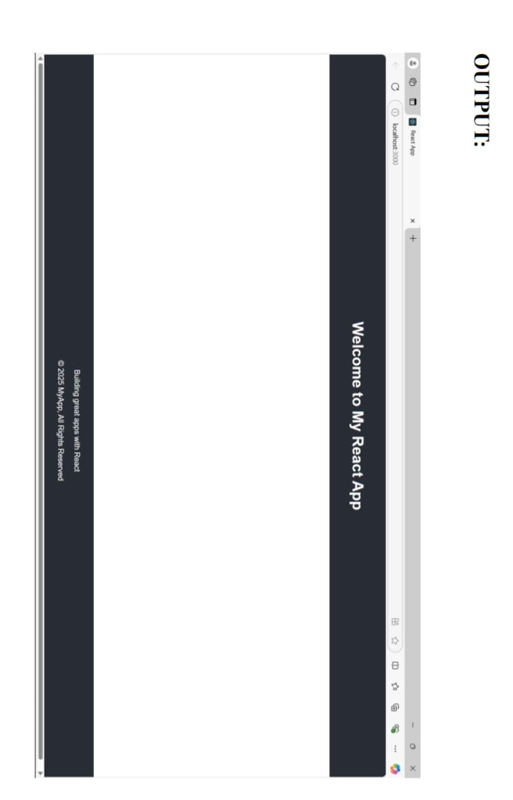
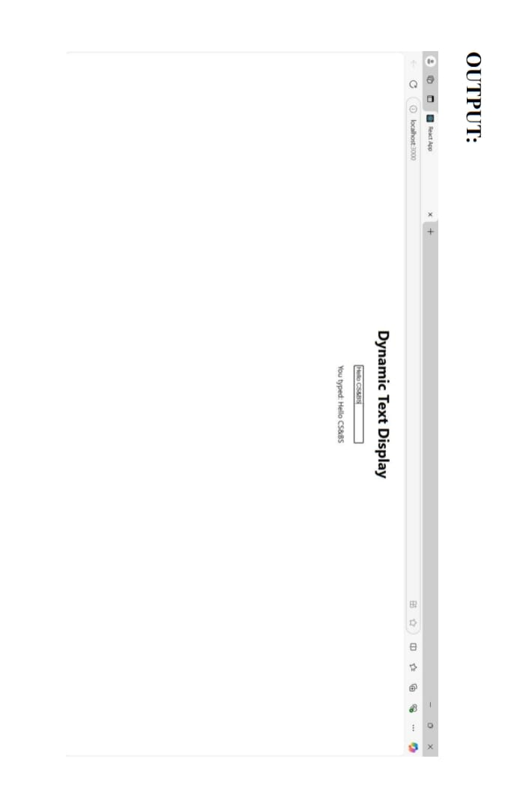
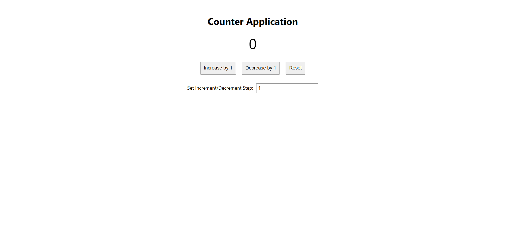
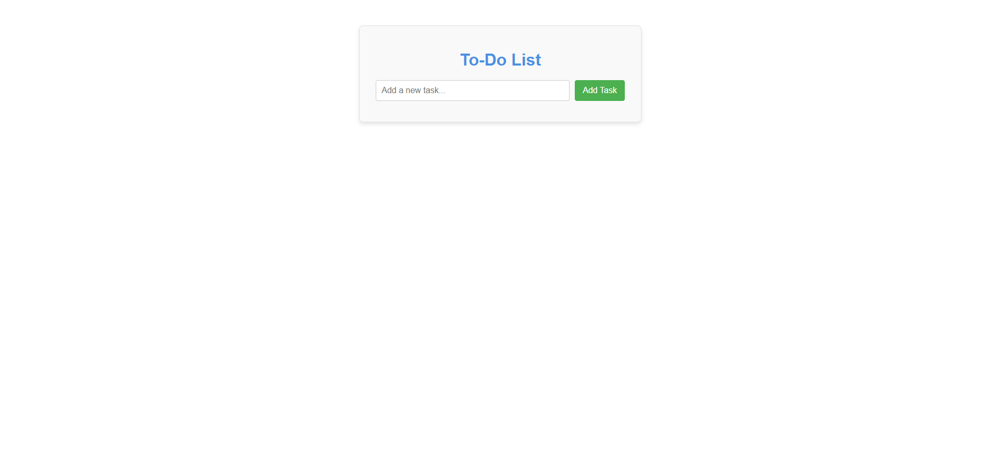

# React (BCSL657B)

Repository containing React programs developed during the 6th semester.

## Programs

- **[my-app(Program-1)](./my-app(Program-1))**: A basic React application demonstrating the use of props to pass data from a parent `App` component to `Header` and `Footer` child components.
  
- **[my-dynamic-app(Program-2)](./my-dynamic-app(Program-2))**: A practice application reinforcing the concepts of component structure and props usage.
  
- **[my-counter-app(Program-3)](./my-counter-app(Program-3))**: A Counter Application using the `useState` hook to demonstrate state management, including increment, decrement, reset, and custom step functionality.
  
- **[my-todo-app(Program-4)](./my-todo-app(Program-4))**: A To-Do List Application using React functional components and the `useState` hook to manage tasks, allowing users to add, delete, and toggle task completion.
  
