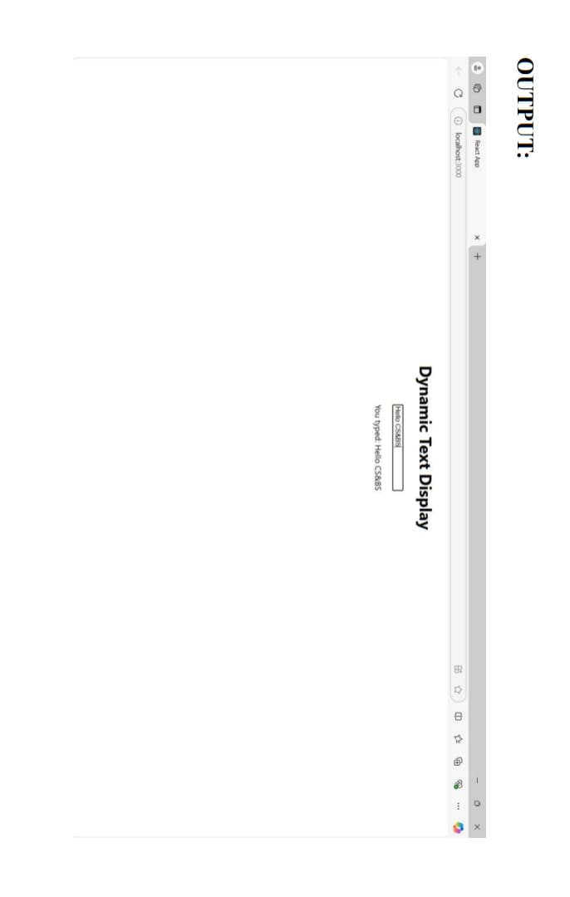
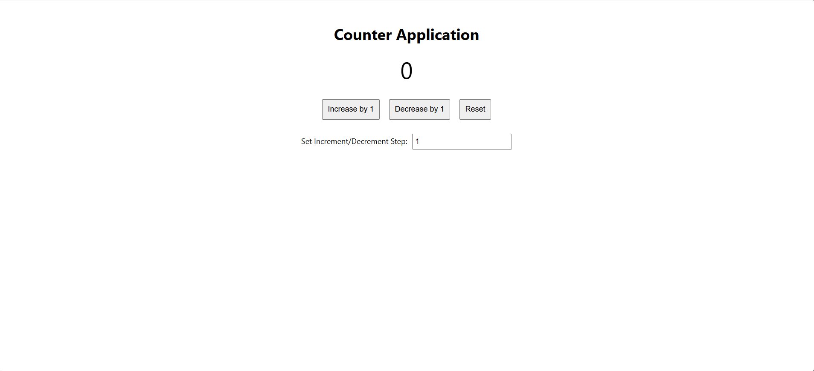
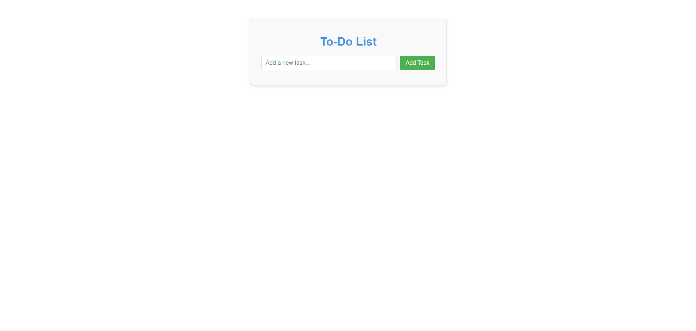
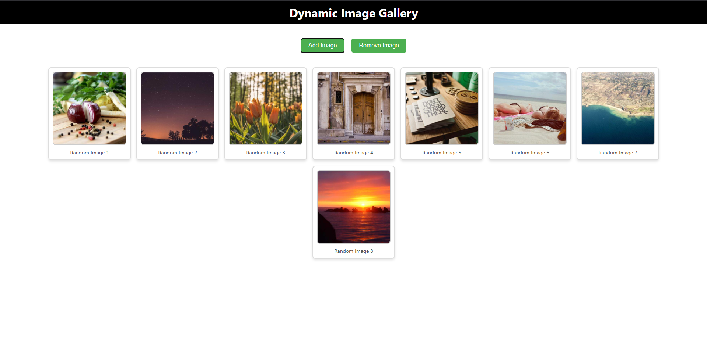
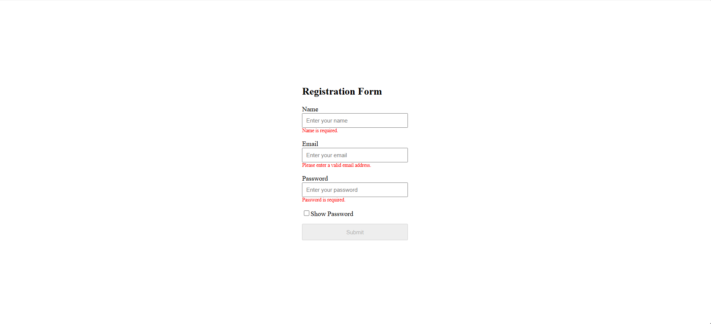
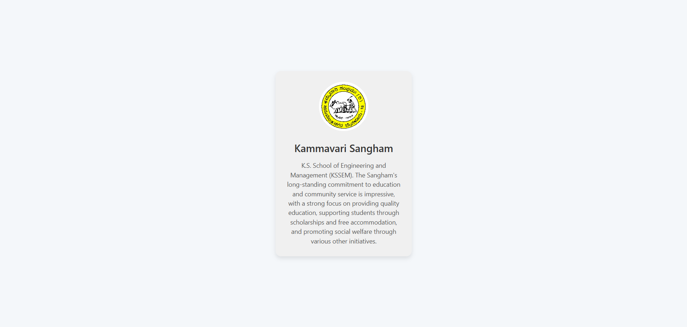
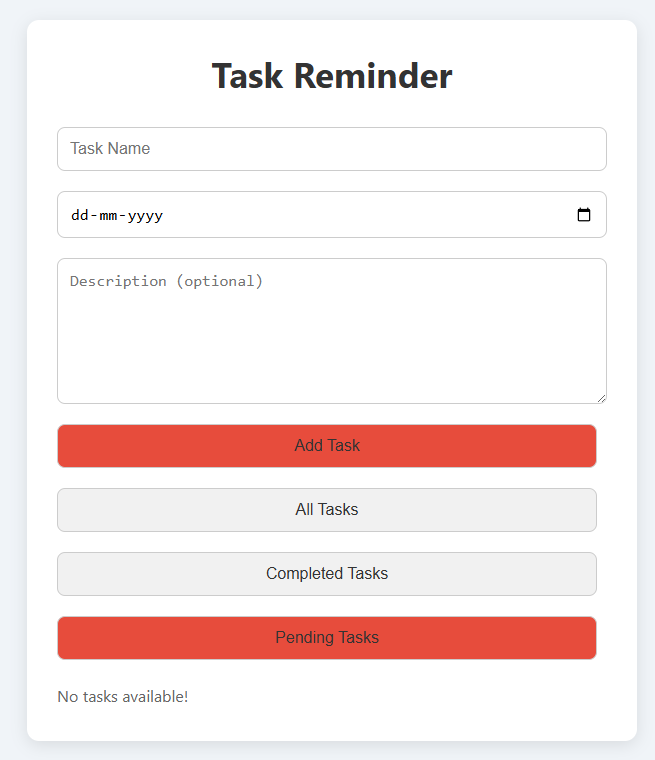
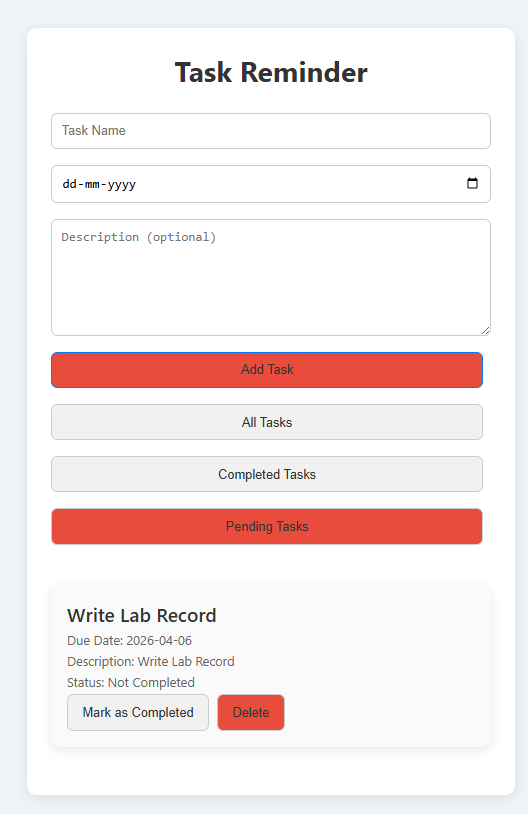
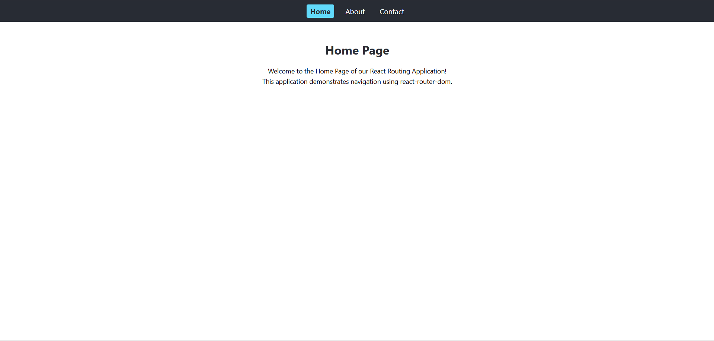
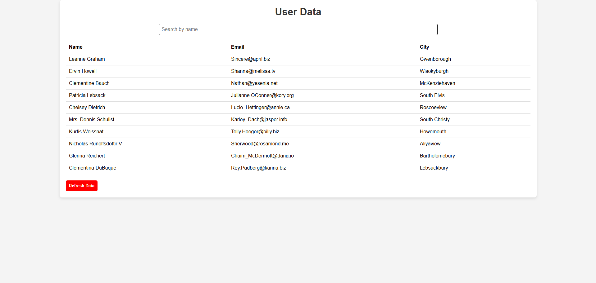

# React (BCSL657B)

Repository containing React programs developed during the 6th semester.

## Programs

- **[Program-1](./Program-1)**: A basic React application demonstrating the use of props to pass data from a parent `App` component to `Header` and `Footer` child components.
  

    
  

- **[Program-2](./Program-2)**: A practice application reinforcing the concepts of component structure and props usage.
  

    
  

- **[Program-3](./Program-3)**: A Counter Application using the `useState` hook to demonstrate state management, including increment, decrement, reset, and custom step functionality.
  

    
  

- **[Program-4](./Program-4)**: A To-Do List Application using React functional components and the `useState` hook to manage tasks, allowing users to add, delete, and toggle task completion.
  

    
  

- **[Program-5](./Program-5)**: A Dynamic Image Gallery application illustrating the use of components to display a list of items dynamically.
  

    
  

- **[Program-6](./Program-6)**: A Registration Form with full validation, including name, email, and password checks, using `useState` and `useEffect` hooks.
  

    
  

- **[Program-7](./Program-7)**: A Profile Card component that demonstrates the use of props to display user information such as name, bio, and profile picture.
  

    
  

- **[Program-8](./Program-8)**: A Task Reminder application (To-Do List) with advanced features like task filtering, persistence using `localStorage`, and a responsive layout.
  

    
    
  

- **[Program-9](./Program-9)**: A React application demonstrating SPA (Single Page Application) navigation using `react-router-dom` with Home, About, and Contact routes.
  

    
  

- **[Program-10](./Program-10)**: A Data Fetching application that retrieves and displays user data from an external API using class components and lifecycle methods, including search and filter functionality.
  

    
  

## Recommended VS Code Extensions

For the best development experience across all programs in this repository, it is recommended to install the following VS Code extensions:

- **[ESLint](https://marketplace.visualstudio.com/items?itemName=dbaeumer.vscode-eslint)**: For error checking and code style.
- **[Prettier - Code formatter](https://marketplace.visualstudio.com/items?itemName=esbenp.prettier-vscode)**: For consistent formatting.
- **[ES7+ React/Redux/React-Native snippets](https://marketplace.visualstudio.com/items?itemName=dsznajder.es7-react-js-snippets)**: React productivity snippets.
- **[Auto Close Tag](https://marketplace.visualstudio.com/items?itemName=formulahendry.auto-close-tag)** / **[Auto Rename Tag](https://marketplace.visualstudio.com/items?itemName=formulahendry.auto-rename-tag)**: Improved JSX editing.
